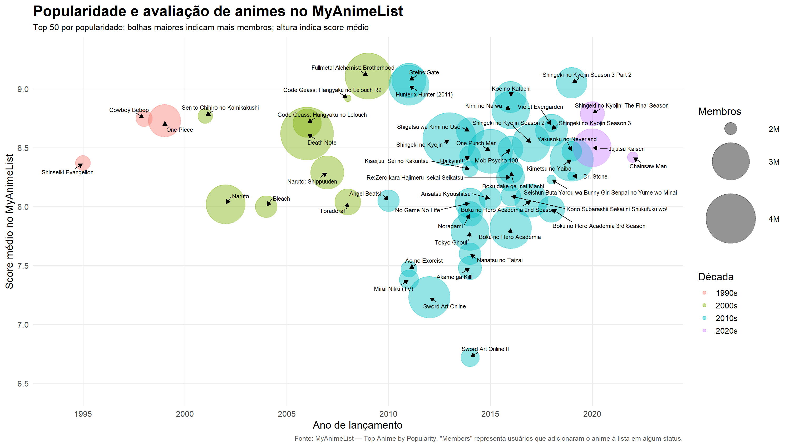

# Relatório

> [!CAUTION]
>
> - Você <ins>**não pode utilizar ferramentas de IA para escrever este relatório**</ins>.

## Identificação

- **Nome**: <mark>`Vinícius Gross Castro`</mark>
- **Cartão UFRGS:** <mark>`00324541`</mark>

## Dados utilizados

> [!IMPORTANT]
>
> - Os dados utilizados devem ser informados como **links** para as fontes originais.
> - Se houver mais de um conjunto de dados, liste todos separadamente.
> - Para cada conjunto de dados, inclua também uma **descrição curta** explicando os dados.

1. **Dataset 1**: <mark>`https://myanimelist.net/topanime.php?type=bypopularity`</mark>
    * **Descrição curta**: <mark>`Para criar a visualização, foram coletados os 50 primeiros animes do ranking de popularidade, incluíndo título, número de episódios, ano de lançamentoe número de "membros". No site, membros representam usuários que adicionaram o anime a sua lista pessoal de animes.`</mark>

## Código-fonte da visualização

> [!IMPORTANT]
>
> - Indique abaixo onde está, dentro deste repositório, o código-fonte usado para gerar a visualização.

- **Arquivo principal**: <mark>`plot.R`</mark>
- **Arquivos complementares (se houver)**: <mark>`dados/animes_mal.csv`</mark>

## Imagem da visualização gerada

> [!IMPORTANT]
>
> - Insira aqui uma imagem da visualização criada por você. Troque `imagem-da-visualizacao.png` pelo caminho correto do arquivo no repositório. 
> - Se você criou alguma visualização interativa, então descreva aqui como acessá-la. Por exemplo, se for uma página HTML, coloque o link, ou se for uma visualização 3D, descreva como compilar e executar o código. 

## Descrição da visualização

### Legenda (*caption*)

> [!IMPORTANT]
>
> - Escreva um texto curto explicando como interpretar a visualização. Descreva os elementos visuais, eixos, cores, símbolos ou interações relevantes.
> - Este texto seria a legenda (*caption*) que acompanharia a figura em uma publicação, por exemplo.

<mark>`Visualização dos 50 animes mais populares do MyAnimeList em um gráfico de dispersão com bolhas. Cada bolha representa um anime diferente. O eixo horizontal mostra o ano de lançamento, e o eixo vertical indica o score médio no site. O tamanho da bolha representa o número de membros, isto é, a quantidade de usuários que adicionaram o anime a sua lista pessoal. A cor indica a década de lançamento. Os rótulos e setas identificam os títulos representados.`</mark>

### Conclusão demonstrada pela visualização

> [!IMPORTANT]
>
> - Escreva uma conclusão curta sobre os dados com base na visualização.
> - Explique qual insight, padrão ou tendência pode ser observado.

<mark>`A visualização demonstra que nem sempre boas avaliações andam junto com popularidade. Entre os 50 animes mais populares do MyAnimeList, muitos títulos possuem uma nota alta (acimade 8.0), porém nem todos animes populares são os mais bem avalidaos. É possível notar que existe uma concentração de animes lançados entre 2010 e 2020, enquanto existem poucos mais antigos no Top 50. Porém, os títulos antigos que continuam no Top 50 possuem excelentes scores. Nos levando a considerar que eles "sobreviveram ao teste do tempo", justamente por causa das suas boas avaliações. `</mark>
